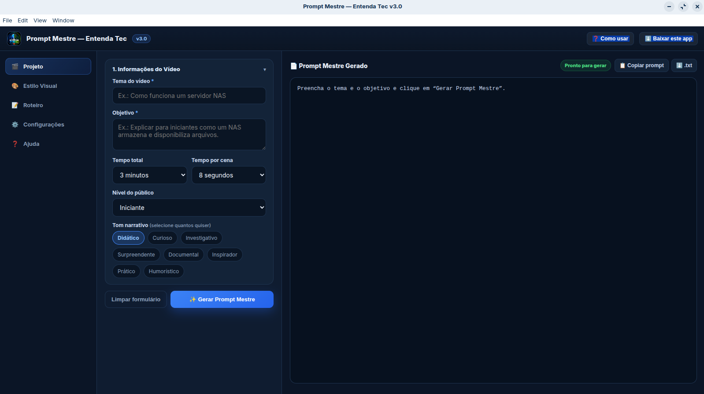

# 🧠 Entenda Tec

**Entenda Tec** é um aplicativo desktop desenvolvido para facilitar a criação e organização de projetos de vídeos técnicos e cinematográficos.

O aplicativo ajuda a transformar uma ideia em um projeto estruturado, reunindo prompts, roteiro, narração, imagens e conteúdo para publicação.

---

## 🚀 Download

A versão mais recente disponível para testes é a **v1.0.4**.

### 🪟 Windows

Baixe o instalador:

**Entenda Tec Setup 1.0.4.exe**

### 🐧 Linux

Para distribuições baseadas em Debian/Ubuntu, como Zorin OS:

**entendatec_1.0.4_amd64.deb**

Também está disponível o formato:

**Entenda Tec-1.0.4.AppImage**

### 📦 Todos os downloads

👉 [Baixar Entenda Tec v1.0.4](https://github.com/entendatec-cmyk/entendatec/releases/tag/v1.0.4)

---

## ✨ Principais recursos

- 🎯 Geração de Prompt Mestre
- 🎨 Diversos estilos visuais para vídeos
- 📝 Estruturação de roteiros
- 🎬 Criação de prompts para cenas
- 🎙️ Organização de narração
- 🖼️ Prompts para geração de imagens
- 📺 Conteúdo para YouTube
- 🤖 Integração de fluxo de trabalho com IA
- 📦 Exportação completa do projeto
- 📖 Manual integrado de utilização
- 🪟 Suporte para Windows
- 🐧 Suporte para Linux

---

## 🎬 Fluxo de trabalho

O Entenda Tec foi pensado para simplificar o processo:

**Ideia → Roteiro → Prompt Mestre → IA → Cenas → Narração → Imagens → Vídeo → YouTube**

O aplicativo organiza as diferentes etapas para que o projeto fique mais fácil de produzir e revisar.

---

## 🧪 Versão de testes

A versão **1.0.4** é uma versão de testes destinada aos primeiros usuários.

Se você encontrar algum problema, comportamento inesperado ou tiver uma sugestão, envie um relato pelo GitHub.

---

## 🐛 Relatar um problema

Encontrou um problema?

Abra uma **Issue** no GitHub informando:

1. Sistema operacional
2. Versão do Entenda Tec
3. O que você estava fazendo
4. O que aconteceu
5. Se possível, uma captura de tela

---

## 💡 Sugestões

Sugestões de novos recursos também são bem-vindas.

Explique:

- Qual recurso você gostaria de ter
- Como ele funcionaria
- Por que ele seria útil

---

## 📖 Documentação

O aplicativo possui um manual integrado explicando o fluxo de utilização, desde a criação do projeto até a organização dos resultados gerados pela IA.

---

## 📦 Tecnologias

O Entenda Tec utiliza:

- Electron
- HTML
- CSS
- JavaScript
- Node.js
- Electron Builder

---

## 📜 Licença

Informações sobre licenciamento serão adicionadas posteriormente.

---

## 🎯 Entenda Tec

Um projeto para tornar a criação de vídeos técnicos mais organizada, visual e acessível.

**Entenda a tecnologia. Crie. Explique. Compartilhe.**
